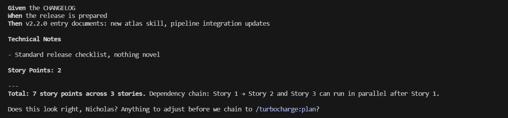
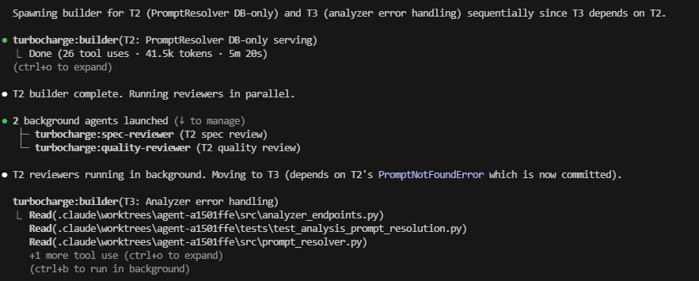

# Turbocharge

**One system to rule them all.** Turbocharge replaces ad-hoc agents, scattered skills, and custom commands with a single opinionated pipeline — from idea to shipped code.

## Why This Exists

Claude Code's agent ecosystem creates a problem: too many overlapping tools with unclear boundaries. Custom agents in `~/.claude/agents/`, project-level commands in `.claude/commands/`, slash commands from plugins — Claude doesn't know which system to use, and neither do you.

Turbocharge fixes this by being **the only orchestration system you need.** One pipeline, clear handoffs, no ambiguity.

### What to Remove When You Install This

- Custom agents in `~/.claude/agents/` that overlap with turbocharge agents (planner, code-reviewer, tdd-guide, session-wrapper, etc.)
- Project commands in `.claude/commands/` for session-wrap, story-authoring, or task-breakdown
- Any `agents.md` rule file that references a parallel agent system

Your `~/.claude/rules/common/agents.md` should point to turbocharge as the primary system, not list competing agents.

## Quick Start

```bash
# Install from marketplace
claude plugin marketplace add nicodiansk/turbocharge-marketplace
claude plugin install turbocharge

# Update to latest version
claude plugin update turbocharge@turbocharge-marketplace

# Or load locally for development
claude --plugin-dir ./turbocharge
```

Then just use the pipeline:

```bash
/turbocharge:brainstorm I want to build a CLI tool that manages git worktrees
/turbocharge:plan docs/plans/my-feature-stories.md
/turbocharge:wrap
```

## The Pipeline

```
brainstorm → story → plan → build → review → ship
                                  ↑               |
                                debug            wrap
                                  ↑
                                atlas (any point)
```

Each skill chains to the next. You can enter at any point — don't need to start from brainstorm every time.

| Entry Point | When |
|-------------|------|
| `brainstorm` | Vague idea, need to explore requirements |
| `story` | Requirements clear, need INVEST-compliant stories |
| `plan` | Stories approved, need implementation tasks |
| `build` | Plan exists, time to write code |
| `review` | Code done, need pre-merge assessment |
| `atlas` | Need a domain map of the project |
| `debug` | Something's broken (side-branch, use anytime) |
| `ship` | Ready to merge, PR, or discard |
| `wrap` | Session ending, need continuity |

## Skills (10)

### setup
Run once after installing. Audits global config for conflicts — duplicate agents, competing skills, stale rules — and offers to fix them.

### atlas
Generates a semantic domain map (ATLAS.md) of the project — entry points, data flows, domain model, module purposes, integration points. Complements codemap for structural indexing. Run after setup or whenever the codebase evolves significantly.

### brainstorm
Socratic requirements discovery. Asks questions one at a time, proposes 2-3 approaches with trade-offs, saves design doc. No implementation.

### story
Transforms requirements into INVEST-compliant user stories with testable acceptance criteria and story point estimates.



### plan
Breaks stories into 2-5 minute tasks with exact file paths, complete code, and TDD steps. Every task starts with a failing test.

### build
Executes the plan. Dispatches builder agents with a review chain per task:

```
builder → spec-reviewer → quality-reviewer
              ↓ issues?        ↓ issues?
         back to builder   back to builder
         (max 2 cycles)    (max 2 cycles)
```

Runs in 3-task batches with human checkpoints. Multi-track mode available for independent parallel tasks.



### review
Holistic pre-merge assessment against the original plan. Checks architecture, quality, security, and plan alignment.

### debug
Systematic 4-phase root-cause investigation. Enforces investigation before fixes. 3+ failed fixes triggers architectural questioning.

### ship
Verifies tests pass, then presents options: merge locally, create PR, keep branch, or discard.

### wrap
Captures session state, encodes learnings into memory/CLAUDE.md, generates a copy-paste resume prompt for the next session.

## Agents (6)

| Agent | Role | Properties |
|-------|------|------------|
| builder | TDD implementation | worktree isolation, full tool access |
| planner | Task decomposition | domain verification before planning |
| researcher | Codebase exploration | haiku model, background execution |
| spec-reviewer | Spec compliance | read-only, doesn't trust builder claims |
| quality-reviewer | Code quality | read-only, categorized issue reporting |
| code-reviewer | Pre-merge holistic review | read-only, runs once after all tasks |

All agents use `memory: project` for persistent codebase knowledge.

## Iron Laws

These are enforced, not suggested:

- `NO IMPLEMENTATION WITHOUT UNDERSTANDING REQUIREMENTS FIRST`
- `NO STORY WITHOUT ACCEPTANCE CRITERIA`
- `NO TASK MARKED COMPLETE WITHOUT REVIEW CHAIN VERIFICATION`
- `NO MERGE WITHOUT CODE REVIEW`
- `NO FIXES WITHOUT ROOT CAUSE INVESTIGATION FIRST`
- `NO SESSION END WITHOUT WRAP OFFER`
- `NO ATLAS WITHOUT READING THE CODEBASE FIRST`

## Complementary Project Skills

Turbocharge covers the full build pipeline but not every workflow. Keep project-level commands for things turbocharge doesn't do:

- **epic-author** — Business-level epic drafting (WHAT and WHY, not HOW)
- **consistency-review** — Cross-domain coherence validation between stories/tasks/epics

These live in `.claude/commands/` and complement turbocharge without overlapping.

## Validation

```bash
./scripts/validate.sh
```

## Directory Structure

```
turbocharge/
├── .claude-plugin/         # Plugin manifest
├── skills/                 # 10 skill definitions
│   └── <skill>/SKILL.md
├── agents/                 # 6 agent definitions
│   └── <agent>.md
├── hooks/                  # Lifecycle hooks
│   ├── hooks.json          # Hook registration
│   ├── session-start.sh    # SessionStart: bootstrap + project checks
│   ├── pretool-read-codemap.sh  # PreToolUse: codemap nudge on Read
│   ├── session-bootstrap.md
│   ├── missing-claudemd-nudge.md
│   ├── missing-atlasmd-nudge.md
│   └── stop-wrap-reminder.md
├── images/                 # README screenshots
├── docs/                   # Guides
├── scripts/validate.sh     # Plugin health check
├── examples/               # Sample pipeline outputs
├── settings.json
└── README.md
```

## License

MIT — See [LICENSE](LICENSE) for details.
