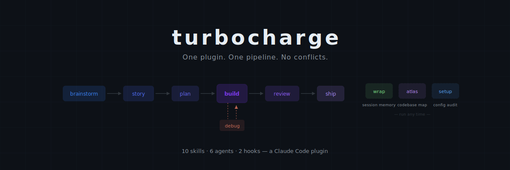
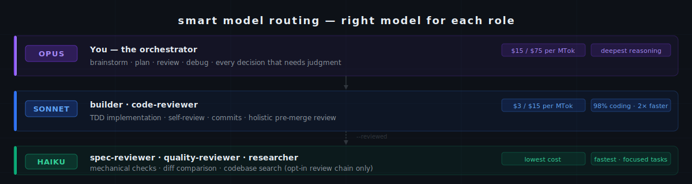

<p align="center">
  
</p>

<p align="center">
  <a href="LICENSE"></a>
  
  
  
</p>

---

You have 6 agents in `~/.claude/agents/`, 4 custom commands, 3 rule files that contradict each other, and a `planner-actually-good.md` you wrote at 2 AM. Claude picks whichever it finds first. You can't remember which is current. Neither can Claude.

**Turbocharge replaces all of it** with a single opinionated pipeline: 10 skills, 6 agents, 2 hooks. One system to install, nothing to maintain.

## Install

```bash
claude plugin marketplace add nicodiansk/turbocharge
claude plugin install turbocharge@turbocharge
```

Restart Claude Code, then start building:

```bash
/turbocharge:brainstorm I want to build a CLI tool that manages git worktrees
```

<details>
<summary>Other install methods</summary>

**Local development (per-session):**
```bash
claude --plugin-dir ./turbocharge
```

**Update:**
```bash
claude plugin update turbocharge@turbocharge
```
</details>

## The Pipeline

```
brainstorm → story → plan → build → review → ship
                                ↑
                              debug
```

Enter at any step. Each skill gates the next. `debug` loops under `build` when bugs surface.

**`wrap`** stands alone — run it any time to capture session state, decisions, and a resume prompt for your next session.

**`atlas`** stands alone — generates `ATLAS.md` domain map from the actual codebase. Pre-loaded every session for zero-tool-call navigation.

| Skill | Command | What it does |
|:------|:--------|:-------------|
| **setup** | `/turbocharge:setup` | Audits config for conflicting agents/skills/rules. Bootstraps `CLAUDE.md`. |
| **atlas** | `/turbocharge:atlas` | Generates `ATLAS.md` domain map. Pre-loaded every session. |
| **brainstorm** | `/turbocharge:brainstorm` | Socratic requirements discovery before implementation |
| **story** | `/turbocharge:story` | INVEST-compliant story breakdown with acceptance criteria |
| **plan** | `/turbocharge:plan` | Bite-sized task decomposition — 2-5 min tasks, exact paths, complete code |
| **build** | `/turbocharge:build` | Plan execution with Sonnet builder + self-review. Opt-in review chain (`--reviewed`) for high-risk tasks. |
| **review** | `/turbocharge:review` | Holistic pre-merge code review against the original plan |
| **debug** | `/turbocharge:debug` | Systematic 4-phase root-cause investigation — no fix until cause is proven |
| **ship** | `/turbocharge:ship` | Test verification, then merge / PR / keep / discard |
| **wrap** | `/turbocharge:wrap` | Session continuity — captures state, generates resume prompt |

## How Build Works

**Default — builder only (fast, cheap):**

```
builder (Sonnet) → self-review → commit
```

**With `--reviewed` flag — for security-sensitive or unfamiliar codebases:**

```
builder (Sonnet) → spec-reviewer (Haiku) → quality-reviewer (Haiku)
                        ↓ issues?                ↓ issues?
                   back to builder           back to builder
                    (max 2 cycles)            (max 2 cycles)
```

Every 3 tasks, the pipeline checkpoints with you for feedback. After all tasks, chain to `/turbocharge:review` for the final holistic assessment.

**Multi-track mode** — independent tasks can run in parallel with coordinated builders. Requires Agent Teams (experimental):

```bash
claude config set env.CLAUDE_CODE_EXPERIMENTAL_AGENT_TEAMS 1
```

## Agents

Dispatched by skills. You never invoke them directly.

<p align="center">
  
</p>

| Agent | Role | Model |
|:------|:-----|:------|
| **builder** | TDD implementation, self-review, commits | Sonnet |
| **planner** | Task breakdown, verifies entity names against codebase | inherit |
| **researcher** | Fast background codebase exploration | Haiku |
| **spec-reviewer** | Verifies implementation matches spec (opt-in) | Haiku |
| **quality-reviewer** | Code quality and production readiness (opt-in) | Haiku |
| **code-reviewer** | Holistic pre-merge assessment | Sonnet |

All agents have `memory: project` for persistent codebase knowledge across sessions.

## Hooks

| Hook | When | What |
|:-----|:-----|:-----|
| **SessionStart** | Start of session | Loads `ATLAS.md` Where to Look table, injects CodeMap stats when `.codemap/` present, restores session snapshot, flags missing files, checks ATLAS staleness |
| **Stop** | End of session | Reminds you to run `/turbocharge:wrap` before closing |

## Quick Start Examples

```bash
# Full pipeline from scratch
/turbocharge:brainstorm I want to build a REST API for managing bookmarks

# Jump to planning with existing requirements
/turbocharge:plan docs/plans/my-feature-stories.md

# Debug a specific issue
/turbocharge:debug The auth middleware is rejecting valid tokens

# Wrap up your session
/turbocharge:wrap
```

See [`examples/`](examples/) for sample outputs from each stage.

## What to Remove After Installing

Turbocharge replaces scattered config. `/turbocharge:setup` handles this, but in short:

- Agents in `~/.claude/agents/` (planner, code-reviewer, tdd-guide, session-wrappers)
- Commands in `.claude/commands/` for story-authoring, task-breakdown, session-wrap
- Rule files that reference competing agents

## Project Structure

```
turbocharge/
├── .claude-plugin/
│   ├── plugin.json              # Plugin manifest
│   └── marketplace.json         # Distribution config
├── skills/                      # 10 skill definitions
│   └── <skill-name>/SKILL.md
├── agents/                      # 6 agent definitions
│   └── <agent-name>.md
├── hooks/
│   ├── hooks.json               # Hook registration
│   └── *.md                     # Hook content files
├── scripts/
│   ├── validate.sh              # Plugin health check
│   └── tests/                   # Content-shape tests
├── examples/                    # Sample pipeline outputs
├── settings.json
├── CHANGELOG.md
└── README.md
```

## Validate

```bash
./scripts/validate.sh
```

## License

MIT — see [LICENSE](LICENSE).

---

<p align="center">
  <sub>Built by <a href="https://github.com/nicodiansk">@nicodiansk</a> — one pipeline to replace them all.</sub>
</p>
