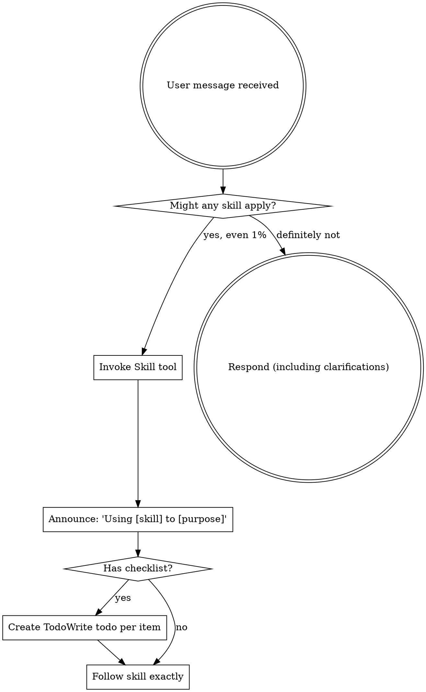

<EXTREMELY-IMPORTANT>
If you think there is even a 1% chance a skill might apply to what you are doing, you ABSOLUTELY MUST read the skill.

IF A SKILL APPLIES TO YOUR TASK, YOU DO NOT HAVE A CHOICE. YOU MUST USE IT.

This is not negotiable. This is not optional. You cannot rationalize your way out of this.
</EXTREMELY-IMPORTANT>

# Using Skills

## The Rule

**Check for skills BEFORE ANY RESPONSE.** This includes clarifying questions. Even 1% chance means invoke the Skill tool first.

## Red Flags

These thoughts mean STOP—you're rationalizing:

| Thought | Reality |
|---------|---------|
| "This is just a simple question" | Questions are tasks. Check for skills. |
| "I need more context first" | Skill check comes BEFORE clarifying questions. |
| "Let me explore the codebase first" | Skills tell you HOW to explore. Check first. |
| "I can check git/files quickly" | Files lack conversation context. Check for skills. |
| "Let me gather information first" | Skills tell you HOW to gather information. |
| "This doesn't need a formal skill" | If a skill exists, use it. |
| "I remember this skill" | Skills evolve. Read current version. |
| "This doesn't count as a task" | Action = task. Check for skills. |
| "The skill is overkill" | Simple things become complex. Use it. |
| "I'll just do this one thing first" | Check BEFORE doing anything. |
| "This feels productive" | Undisciplined action wastes time. Skills prevent this. |

## Skill Priority

When multiple skills could apply, use this order:

1. **Process skills first** (brainstorming, systematic-debugging) - these determine HOW to approach the task
2. **Planning skills second** (writing-plans, story-breakdown) - these structure the work
3. **Implementation skills third** (test-driven-development, subagent-driven-development) - these guide execution
4. **Review skills last** (requesting-code-review, verification-before-completion) - these ensure quality

"Let's build X" → brainstorming first, then writing-plans, then implementation skills.
"Fix this bug" → systematic-debugging first, then test-driven-development.
"Create epic/stories" → story-breakdown first, then writing-plans.

## Available Skills

Turbocharge includes these skills (invoke with `/tc:` commands or Skill tool):

### Process Skills
- **brainstorming** - Interactive design refinement through Socratic dialogue
- **systematic-debugging** - Four-phase debugging framework (investigate → analyze → test → implement)

### Planning Skills
- **writing-plans** - Create detailed implementation plans with verification steps
- **story-breakdown** - Transform requirements into INVEST-compliant epics and stories
- **executing-plans** - Execute plans in controlled batches with review checkpoints

### Implementation Skills
- **test-driven-development** - Write failing tests first, then minimal code to pass
- **subagent-driven-development** - Dispatch agents for tasks with code review between
- **using-git-worktrees** - Isolated feature development with git worktrees
- **dispatching-parallel-agents** - Run multiple agents concurrently for independent tasks

### Quality Skills
- **requesting-code-review** - Dispatch code reviewer before merging
- **receiving-code-review** - Handle feedback with technical rigor
- **verification-before-completion** - Run verification commands before claiming success
- **finishing-a-development-branch** - Structured options for merge, PR, or cleanup

### Meta Skills
- **writing-skills** - Create and test skills using TDD principles
- **session-memory** - Maintain context across sessions via `.turbocharge/memory/`

## Skill Types

**Rigid** (TDD, debugging): Follow exactly. Don't adapt away discipline.

**Flexible** (patterns): Adapt principles to context.

The skill itself tells you which.

## User Instructions

Instructions say WHAT, not HOW. "Add X" or "Fix Y" doesn't mean skip workflows.
