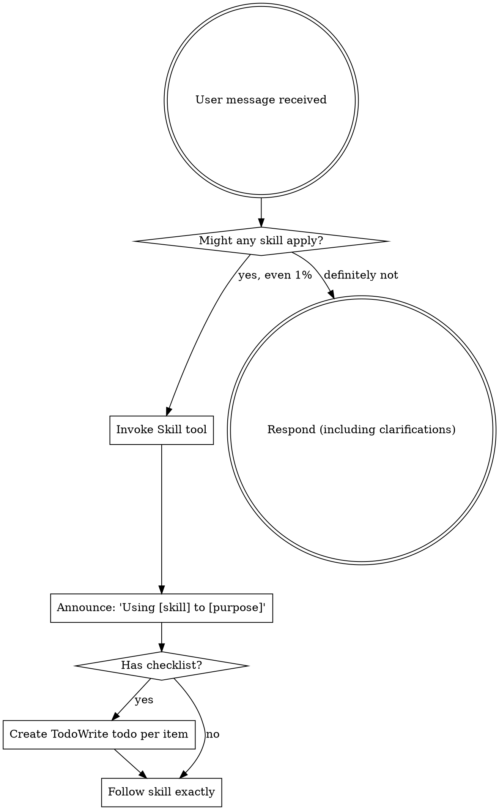

<EXTREMELY-IMPORTANT>
If you think there is even a 1% chance a skill might apply to what you are doing, you ABSOLUTELY MUST read the skill.

IF A SKILL APPLIES TO YOUR TASK, YOU DO NOT HAVE A CHOICE. YOU MUST USE IT.

This is not negotiable. This is not optional. You cannot rationalize your way out of this.
</EXTREMELY-IMPORTANT>

# Using Skills

## The Rule

**Check for skills BEFORE ANY RESPONSE.** This includes clarifying questions. Even 1% chance means invoke the Skill tool first.


```graphviz
digraph skill_flow {
    "User message received" [shape=doublecircle];
    "Might any skill apply?" [shape=diamond];
    "Invoke Skill tool" [shape=box];
    "Announce: 'Using [skill] to [purpose]'" [shape=box];
    "Has checklist?" [shape=diamond];
    "Create TodoWrite todo per item" [shape=box];
    "Follow skill exactly" [shape=box];
    "Respond (including clarifications)" [shape=doublecircle];

    "User message received" -> "Might any skill apply?";
    "Might any skill apply?" -> "Invoke Skill tool" [label="yes, even 1%"];
    "Might any skill apply?" -> "Respond (including clarifications)" [label="definitely not"];
    "Invoke Skill tool" -> "Announce: 'Using [skill] to [purpose]'";
    "Announce: 'Using [skill] to [purpose]'" -> "Has checklist?";
    "Has checklist?" -> "Create TodoWrite todo per item" [label="yes"];
    "Has checklist?" -> "Follow skill exactly" [label="no"];
    "Create TodoWrite todo per item" -> "Follow skill exactly";
}
```

## Red Flags

These thoughts mean STOP—you're rationalizing:

| Thought | Reality |
|---------|---------|
| "This is just a simple question" | Questions are tasks. Check for skills. |
| "I need more context first" | Skill check comes BEFORE clarifying questions. |
| "Let me explore the codebase first" | Skills tell you HOW to explore. Check first. |
| "I can check git/files quickly" | Files lack conversation context. Check for skills. |
| "Let me gather information first" | Skills tell you HOW to gather information. |
| "This doesn't need a formal skill" | If a skill exists, use it. |
| "I remember this skill" | Skills evolve. Read current version. |
| "This doesn't count as a task" | Action = task. Check for skills. |
| "The skill is overkill" | Simple things become complex. Use it. |
| "I'll just do this one thing first" | Check BEFORE doing anything. |
| "This feels productive" | Undisciplined action wastes time. Skills prevent this. |

## Anti-Bypass Rules

**NEVER dispatch built-in Task tool agents directly.** Turbocharge skills are the ONLY authorized way to orchestrate work.

**Prohibited bypasses:**

| Bypass | Required Instead |
|--------|-----------------|
| Task tool with `code-reviewer` agent | Use **requesting-code-review** skill |
| Task tool with `plan` agent | Use **writing-plans** skill |
| Task tool with `general-purpose` for implementation | Use **subagent-driven-development** skill |
| Task tool with `quality-engineer` agent | Use **subagent-driven-development** skill (dispatches quality-reviewer) |
| Task tool with `refactoring-expert` agent | Use **subagent-driven-development** skill |
| Task tool with `root-cause-analyst` agent | Use **systematic-debugging** skill |
| EnterPlanMode tool directly | Use **writing-plans** skill |

**Why this matters:** Skills enforce discipline. They include checklists, verification steps, handoff protocols, and review gates. Direct agent dispatch skips all of these.

**The test:** If you're about to use the Task tool, ask: "Is there a turbocharge skill for this?" If yes (even partially), use the skill.

## Skill Priority

When multiple skills could apply, use this order:

1. **Process skills first** (brainstorming, systematic-debugging) - these determine HOW to approach the task
2. **Planning skills second** (writing-plans, story-breakdown) - these structure the work
3. **Implementation skills third** (test-driven-development, subagent-driven-development) - these guide execution
4. **Review skills last** (requesting-code-review, verification-before-completion) - these ensure quality

"Let's build X" → brainstorming first, then writing-plans, then implementation skills.
"Fix this bug" → systematic-debugging first, then test-driven-development.
"Create epic/stories" → story-breakdown first, then writing-plans.

## Available Skills

Turbocharge includes these skills (invoke with slash commands like `/brainstorm`, `/story`, etc. or Skill tool):

### Process Skills
- **brainstorming** - Interactive design refinement through Socratic dialogue
- **systematic-debugging** - Four-phase debugging framework (investigate → analyze → test → implement)

### Planning Skills
- **writing-plans** - Create detailed implementation plans with verification steps
- **story-breakdown** - Transform requirements into INVEST-compliant epics and stories
- **executing-plans** - Execute plans in controlled batches with review checkpoints

### Implementation Skills
- **test-driven-development** - Write failing tests first, then minimal code to pass
- **subagent-driven-development** - Dispatch agents for tasks with code review between
- **using-git-worktrees** - Isolated feature development with git worktrees
- **dispatching-parallel-agents** - Run multiple agents concurrently for independent tasks

### Quality Skills
- **requesting-code-review** - Dispatch code reviewer before merging
- **receiving-code-review** - Handle feedback with technical rigor
- **verification-before-completion** - Run verification commands before claiming success
- **finishing-a-development-branch** - Structured options for merge, PR, or cleanup

### Meta Skills
- **using-turbocharge** - Foundational skill for discovering and using all other skills
- **writing-skills** - Create and test skills using TDD principles
- **session-memory** - Maintain context across sessions via `.turbocharge/memory/`

## Skill Types

**Rigid** (TDD, debugging): Follow exactly. Don't adapt away discipline.

**Flexible** (patterns): Adapt principles to context.

The skill itself tells you which.

## User Instructions

Instructions say WHAT, not HOW. "Add X" or "Fix Y" doesn't mean skip workflows.

## Commands Reference

Users invoke these slash commands directly. Each dispatches the corresponding skill:

| Command | Skill Invoked | Purpose |
|---------|---------------|---------|
| `/brainstorm` | brainstorming | Explore requirements through collaborative dialogue |
| `/write-plan` | writing-plans | Create implementation plan with verifiable tasks |
| `/execute-plan` | executing-plans | Execute plan in batches with review checkpoints |
| `/review` | requesting-code-review | Dispatch code reviewer before merging |
| `/debug` | systematic-debugging | Four-phase debugging with root cause analysis |
| `/tdd` | test-driven-development | Red/green/refactor cycle |
| `/epic` | story-breakdown | Break requirements into epic with child stories |
| `/story` | story-breakdown | Transform requirement into INVEST-compliant story |
| `/memory` | session-memory | Load, save, or clear session context |
| `/finish` | finishing-a-development-branch | Verify tests, present merge/PR/cleanup options |

**When a user types a command, the corresponding skill governs all behavior.** Do not deviate from the skill's protocol.

## Decision Trees

### "Build a feature"
```
User wants feature →
  1. brainstorming (clarify requirements)
  2. story-breakdown (if epic-scale, create stories)
  3. writing-plans (create implementation plan)
  4. subagent-driven-development (execute plan)
  5. requesting-code-review (before merge)
  6. finishing-a-development-branch (merge/PR)
```

### "Fix a bug"
```
User reports bug →
  1. systematic-debugging (investigate root cause)
  2. test-driven-development (write failing test for bug)
  3. verification-before-completion (confirm fix)
  4. requesting-code-review (if significant change)
```

### "Create epics/stories"
```
User wants requirements breakdown →
  1. brainstorming (if requirements are vague)
  2. story-breakdown (create INVEST-compliant stories)
  3. writing-plans (turn stories into implementation plans)
```

### "Review code"
```
User wants review →
  1. requesting-code-review (dispatch code-reviewer agent)
  2. receiving-code-review (handle feedback)
  3. verification-before-completion (verify fixes)
```

### "Continue previous work"
```
User resuming session →
  1. session-memory (load context)
  2. executing-plans (if plan exists)
  3. subagent-driven-development (if tasks remain)
```

### "Refactor code"
```
User wants refactoring →
  1. brainstorming (clarify goals and scope)
  2. writing-plans (plan the refactoring)
  3. test-driven-development (ensure tests exist first)
  4. subagent-driven-development (execute refactoring)
  5. requesting-code-review (before merge)
```

## Workflow Chains

Skills hand off to each other. Each skill's output becomes the next skill's input.

### Feature Development Chain
```
brainstorming → writing-plans → subagent-driven-development → requesting-code-review → finishing-a-development-branch
     │                │                    │                           │
  requirements     plan doc         implemented code            review feedback
```

### Bug Fix Chain
```
systematic-debugging → test-driven-development → verification-before-completion
         │                      │                           │
    root cause           failing test + fix            confirmed fix
```

### Story/Epic Chain
```
brainstorming → story-breakdown → writing-plans → subagent-driven-development
      │                │                │                    │
  raw ideas     epics/stories      plan per story     implemented stories
```

### Subagent Review Loop (within subagent-driven-development)
```
implementer → spec-reviewer → quality-reviewer ──→ next task
                                    │
                              issues found? → implementer (fix loop)
```

### Session Lifecycle
```
session-memory (load) → [any chain above] → session-memory (save)
```

**Handoff rule:** When a skill completes, check if the next skill in the chain applies. Suggest it to the user — don't silently skip ahead or silently stop.
